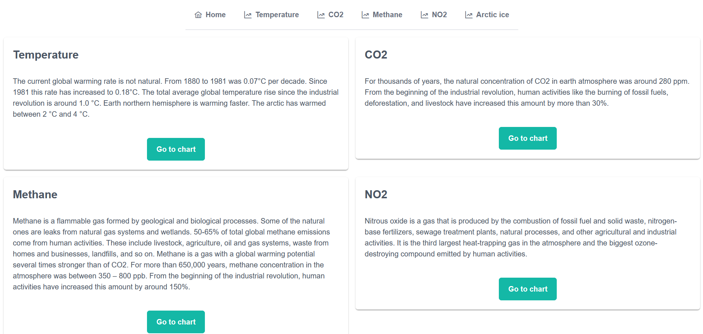

# Global Warming Project

This project was generated with [Angular CLI](https://github.com/angular/angular-cli) version 18.1.0.



## Description

Global Warming is a multi-page web application developed using Angular, designed to display dashboards with data about global warming. It leverages APIs to visualize information on temperature changes, CO2 levels, methane emissions, nitrous oxide concentrations, and Arctic ice loss.

## Features

- **Homepage**: Where you can see the info and navigations to all the charts.
- **Responsive Design**: Built with a mobile-first approach for seamless usage across devices.

## Technologies and External Libraries Used

- **Angular (v18)**: Framework used to build the web application.
- **PrimeNg**: UI component library for styling.
- **TailwindCSS**: For grid layout.
- **Ngx-echarts**: Charts library.

## Installation

### Prerequisites

- Node.js (v18 or higher) must be installed on your system.
- Angular CLI: Install it globally using the following command:

  ```bash
  npm install -g @angular/cli
  ```

### Steps to Set Up Locally

1. Clone the repository:

   ```bash
   git clone https://github.com/Tommaso-Desiato/Global-Warming.git
   cd global-warming
   ```

2. Install dependencies:

   ```bash
   npm install
   ```

3. Start the development server:

   ```bash
   ng serve
   ```

4. Open a browser and navigate to `http://localhost:4200/`.

## Deployment

This application is also deployed on Netlify for public access at this [link](https://global-warming-charts.netlify.app/)
